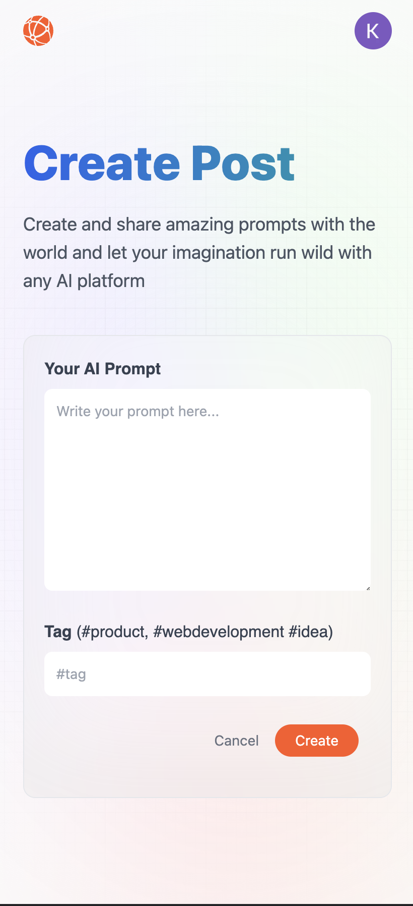

# Promptopia

#### Promptopia is a fully responsive and modern full stack Next 13 AI prompting tool app.

Use the app [here](https://promptopia-xi-one.vercel.app).

# Description
Promptopia is a fully responsive and modern full stack open-source AI prompting tool for the modern world to discover, create and share creative prompts.

# Take a Look at the App

## Desktop:

<kbd>

</kbd>

<kbd>

</kbd>

## Mobile:

<kbd>

</kbd>

<kbd>

</kbd>

<kbd>

</kbd>

<kbd>

</kbd>

# Tools Used

### Development Environment
* Node.js

### Libraries & Frameworks
* React 
* Next.JS 13
* Tailwind

### Authentication
* OAuth 2.0 (Google)

### Backend
* MongoDB
* Mongoose

### Hosting 
* Vercel

# Features

### Users are able to:

* sign in safely and securely using OAuth 2.0 (Google)
* view all prompts from all users
* browse prompts by tag
* browse prompts by username
* create prompts
* edit created prompts
* delete created prompts
